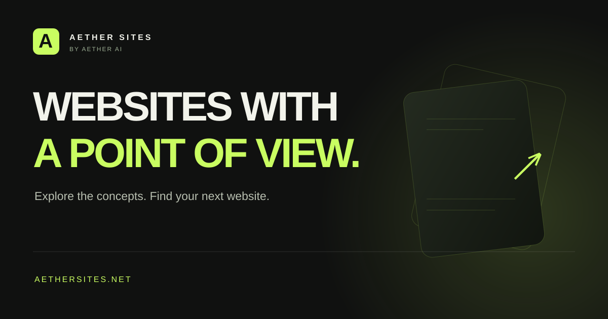

<p align="center"><a href="https://aethersites.net/"></a></p>

# Aether Sites

**All my website concepts and creations, in one place.** Built by Brandon at [Aether AI](https://aethersystems.net/).

[**Explore the collection ↗**](https://aethersites.net/) · [**Purchase a site / arrange hosting ↗**](https://blackstarentertainment.org/#contact)

Browse the concepts, open the full sites, and find a direction you love. Contact me to discuss purchasing an available concept, adapting it to your business, or arranging hosting and ongoing support. Include the concept name or link and what you need; we’ll agree availability, scope, pricing, and handoff before work begins.

Custom website builds are welcome too. Concepts are demonstrations, not claims of commissioned client work. Third-party branding and assets are not automatically included in a purchase.

Each concept has its own top-level folder. This repository holds the source collection.

## The collection

| Folder | Website |
| --- | --- |
| `reworxct/` | Reclaimed furniture and architectural materials; charcoal, ember, and cinematic timber imagery. |
| `ember-and-iron/` | EMBER & IRON Wood-Fired Pizza Co.; hot steel gradients, expanding menu cells, and a sticky Dough / Fire / Char sequence. |

Ember & Iron's complete handoff notes are in [docs/ember-and-iron.md](docs/ember-and-iron.md). The source directive, CSS, and wireframe are retained in `reference/ember-and-iron/`.

## Reworx: `reworxct`

A fresh industrial presentation for Reworx: charcoal surfaces, ember accents, sharp geometry, large Archivo typography, and the supplied cinematic timber imagery. This is an **unofficial design concept**, not Reworx's official website or an endorsed project.

- `reworxct/index.html` — rewritten content and semantic page structure.
- `reworxct/styles.css` — responsive visual system, based on the supplied guide.
- `reworxct/motion.css` — supplied palette gradients, expanding frames, process reveals, and button interactions.
- `reworxct/script.js` — mobile navigation and progressive scroll choreography.
- `reworxct/assets/` — four supplied images, optimized to WebP.
- `docs/reworxct-sources.md` — sources, factual boundaries, and asset provenance.
- `reference/reworxct/` — supplied brand guide and CSS, with image references localized for this repository.
- `scripts/` — dependency-free build and checks.

## Local use

Requires Node.js 20+ and Python 3 for checks. No package installation is needed.

```sh
npm run check
npm run build
python3 -m http.server 8080 --directory dist
```

Open `/` for the Aether Sites showcase, then `/reworxct/` or `/ember-and-iron/` for full concepts. New client concepts should get their own folders; update the showcase, `scripts/build.mjs`, and `scripts/check.py` when adding one.

## Publishing

The build creates `dist/reworxct/`, `dist/ember-and-iron/`, and a root showcase. Both concepts and the showcase are portable static HTML/CSS/JavaScript. Their private previews are managed separately; hosting identities are excluded from this public GitHub snapshot.

The concepts retain visible disclosure and `noindex` metadata/headers. The root showcase can be indexed; its sitemap includes only the root. External contact and booking links point to the real business, and no local form collects leads. Supplied imagery is identified as concept art, not a verified customer portfolio. Do not remove these boundaries when moving hosts without an approved change in project status.

## Motion

Native scrolling drives a contracting hero frame, slow image movement, expanding section edges, and the process rail. Recover, Refine, Design, and Build settle into view in sequence. On desktop the material image holds briefly beside the copy; mobile uses normal document flow and a vertical process rail. Numbered section preheaders and decorative counters have been removed.

The supplied motion CSS and scroll handoff are preserved under `reference/reworxct/`. The shipped adaptation in `motion.css` uses one animation-frame controller for consistent browser behavior. There is no scroll hijacking, autoplay video, or continuous render loop. Reveals remain visible without JavaScript or IntersectionObserver; reduced-motion changes disable the scroll effects and reveal all content. Keyboard focus immediately exposes the focused content.

## Repository and checks

Source: [AetherAI3/aether-sites](https://github.com/AetherAI3/aether-sites).

The GitHub Actions workflow checks the source and builds the static output on pushes to `main` and pull requests. Inspect the Actions tab for the current run result; a workflow file alone does not establish passing CI.
